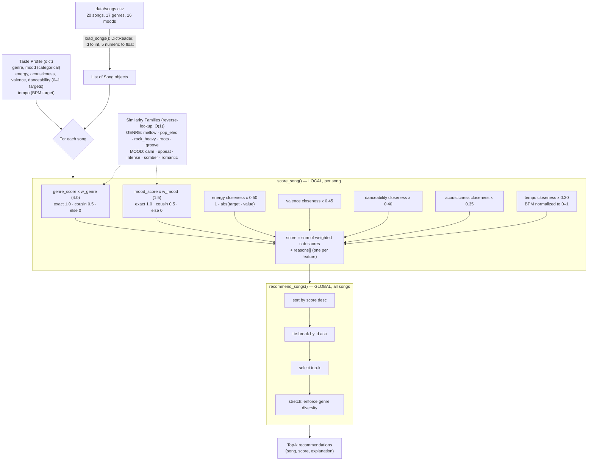

# 🎵 Music Recommender Simulation

## Project Summary

In this project you will build and explain a small music recommender system.

Your goal is to:

- Represent songs and a user "taste profile" as data
- Design a scoring rule that turns that data into recommendations
- Evaluate what your system gets right and wrong
- Reflect on how this mirrors real world AI recommenders

Replace this paragraph with your own summary of what your version does.

---

## How The System Works

Real-world recommenders are usually hybrids of content-based and collaborative
filtering. This simulation is purely **content-based**: it scores each song by
how closely its attributes match a single user's taste profile, using no data
about other users.

**Taste profile** — a small set of targets:

- `genre`, `mood` — categorical preferences (matched case-insensitively)
- `energy`, `acousticness`, `valence`, `danceability` — numeric targets on a 0–1 scale
- `tempo` — a target in **BPM** (normalized to 0–1 internally over a 50–200 range)

Every field is optional; a missing field simply contributes 0.

**Song features used:** genre, mood, energy, acousticness, valence, danceability, tempo.
**Excluded (and why):** `artist` (a sparse, collaborative-style signal),
`title` (free text), `id` (identifier).

### Algorithm recipe

Each song earns points from six weighted sub-scores. Every sub-score is 0–1
*before* its weight is applied:

| Feature | How it's matched | Weight |
|---|---|---|
| genre | exact 1.0 · same family 0.5 · else 0 | **4.0** |
| mood | exact 1.0 · same family 0.5 · else 0 | 1.5 |
| energy | closeness = 1 − abs(target − value) | 0.50 |
| valence | closeness | 0.45 |
| danceability | closeness | 0.40 |
| acousticness | closeness | 0.35 |
| tempo | closeness on BPM normalized to 0–1 | 0.30 |

```
score = 4.0*genre + 1.5*mood + 0.50*energy + 0.45*valence
      + 0.40*danceability + 0.35*acousticness + 0.30*tempo
```

The numeric weights share a deliberately small **2.0 total budget** so they
*fine-tune* the order within a genre rather than competing with it.

**Similarity families** give partial credit for "cousin" genres and moods, so the
system degrades gracefully — a lofi listener sees ambient/jazz before metal
instead of a hard zero for everything non-lofi:

- Genre families: `mellow` · `pop_elec` · `rock_heavy` · `roots` · `groove`
- Mood families: `calm` · `upbeat` · `intense` · `somber` · `romantic`

**Why genre is weighted 4.0.** Genre is the decisive signal, and the weights
make that *provable* rather than hopeful. The invariant is:

```
W_genre (4.0)  >  W_mood (1.5) + Σ(numeric weights) (2.0)  =  3.5
```

An unrelated-genre song earns 0 genre points, so the most it can ever reach is
mood + all numerics = 3.5. An exact-genre song banks 4.0 up front. Therefore
**any exact-genre match outranks any unrelated-genre song**, no matter how well
its mood and audio features line up. (An earlier design weighted genre at 3.0
with a 3.5 numeric budget, which let a perfectly-tuned metal track top a lofi
profile — see *Experiments You Tried*.) Cousins (0.5 × 4.0 = 2.0) can still
overtake a *weak* exact match when overall fit is strong, which is the graceful
degradation we want; the strict guarantee only applies to genuinely unrelated
genres.

**Local scoring vs. global ranking.** `score_song` is *local* — it looks at one
song and returns `(score, reasons)`. `recommend_songs` is *global* — it scores
every song, sorts by score descending, breaks ties by `id`, and returns the
top-k. (Stretch: enforce genre diversity within the top-k.)

### Diagram



### Potential biases and risks

- **Filter-bubble / genre lock-in.** Content-based scoring with a heavy genre
  weight (4.0) strongly favors the user's stated genre and its family, so
  genuinely good cross-genre songs rarely surface. Raising genre from 3.0 to 4.0
  to guarantee genre-dominance *deepens* this trade-off: it buys a provable
  "genre is decisive" rule at the cost of even less serendipity.
- **Subjective family groupings.** The genre/mood families are hand-authored
  judgment calls (e.g., jazz sits with lofi/ambient in *mellow*; reggae with hip
  hop in *groove*). They encode the designer's cultural assumptions; a listener
  who hears jazz as closer to blues is systematically mis-served.
- **Uneven family sizes.** Larger families offer more partial-credit paths, so
  their songs are structurally easier to recommend. The singleton *romantic* mood
  earns cousin credit for nothing but an exact match, while an *upbeat* song (5
  members) picks up 0.5 far more often — an advantage unrelated to real fit.
- **Symmetric-closeness assumption.** `1 − abs(target − value)` penalizes
  exceeding a target exactly as much as falling short. "I want high energy" is not
  the same as "I want energy near 0.9," but the model treats them identically.
- **Tiny catalog.** With 20 songs across 17 genres, most genres have a single
  track, so exact-genre matches are rare and results lean on families and
  numerics — recommendations are unstable and unrepresentative.

(The model card goes deeper on these.)

---

## Getting Started

### Setup

1. Create a virtual environment (optional but recommended):

   ```bash
   python -m venv .venv
   source .venv/bin/activate      # Mac or Linux
   .venv\Scripts\activate         # Windows

2. Install dependencies

```bash
pip install -r requirements.txt
```

3. Run the app:

```bash
python -m src.main
```

### Running Tests

Run the starter tests with:

```bash
pytest
```

You can add more tests in `tests/test_recommender.py`.

---

## Sample Recommendation Output

Running the app with the built-in "focus / study" taste profile:

```bash
python -m src.main
```

produces:

```
🎵  Music Recommender — your top picks

Taste profile: genre=lofi, mood=chill, energy=0.4, acousticness=0.8, valence=0.55, danceability=0.4, tempo=78
----------------------------------------------------------------
1. Midnight Coding — LoRoom  [lofi · chill]
   Score: 7.37
   Why:
     • genre match (lofi) +4.00
     • mood match (chill) +1.50
     • energy fit (target 0.4, song 0.42) +0.49
     • acousticness fit (target 0.8, song 0.71) +0.32
     • valence fit (target 0.55, song 0.56) +0.45
     • danceability fit (target 0.4, song 0.62) +0.31
     • tempo fit (target 78 bpm, song 78 bpm) +0.30
----------------------------------------------------------------
2. Library Rain — Paper Lanterns  [lofi · chill]
   Score: 7.35
   Why:
     • genre match (lofi) +4.00
     • mood match (chill) +1.50
     • energy fit (target 0.4, song 0.35) +0.47
     • acousticness fit (target 0.8, song 0.86) +0.33
     • valence fit (target 0.55, song 0.6) +0.43
     • danceability fit (target 0.4, song 0.58) +0.33
     • tempo fit (target 78 bpm, song 72 bpm) +0.29
----------------------------------------------------------------
3. Focus Flow — LoRoom  [lofi · focused]
   Score: 6.64
   Why:
     • genre match (lofi) +4.00
     • mood cousin of chill (focused) +0.75
     • energy fit (target 0.4, song 0.4) +0.50
     • acousticness fit (target 0.8, song 0.78) +0.34
     • valence fit (target 0.55, song 0.59) +0.43
     • danceability fit (target 0.4, song 0.6) +0.32
     • tempo fit (target 78 bpm, song 80 bpm) +0.30
----------------------------------------------------------------
4. Spacewalk Thoughts — Orbit Bloom  [ambient · chill]
   Score: 5.31
   Why:
     • genre cousin of lofi (ambient) +2.00
     • mood match (chill) +1.50
     • energy fit (target 0.4, song 0.28) +0.44
     • acousticness fit (target 0.8, song 0.92) +0.31
     • valence fit (target 0.55, song 0.65) +0.41
     • danceability fit (target 0.4, song 0.41) +0.40
     • tempo fit (target 78 bpm, song 60 bpm) +0.26
----------------------------------------------------------------
5. Coffee Shop Stories — Slow Stereo  [jazz · relaxed]
   Score: 4.55
   Why:
     • genre cousin of lofi (jazz) +2.00
     • mood cousin of chill (relaxed) +0.75
     • energy fit (target 0.4, song 0.37) +0.48
     • acousticness fit (target 0.8, song 0.89) +0.32
     • valence fit (target 0.55, song 0.71) +0.38
     • danceability fit (target 0.4, song 0.54) +0.34
     • tempo fit (target 78 bpm, song 90 bpm) +0.28
----------------------------------------------------------------
```

**Screenshot or video** *(optional)*: <!-- Insert a screenshot or demo video link here -->

---

## Experiments You Tried

### Adversarial edge-case profiles

I pressure-tested the scoring logic with deliberately hostile taste profiles to
find where it produces unexpected or absurd results. Every block below is real
output from `recommend_songs` against the 20-song catalog.

**1. "Genre is decisive" is conditional — a wrong-genre song can top the list.**
The genre weight is 3.0, but *everything except genre* sums to 5.0 (mood 1.5 +
numeric 1.0+1.0+1.0+0.5). So an off-genre song that collects mood + numeric
points can outrank an exact-genre match. Profile B is a coherent-looking user
("I like the lofi genre but an aggressive mood") whose #1 pick is a **metal**
track — above every lofi song. Profile A is the control: same numerics, but a
mood no intruder can claim, so genre holds.

```
A) genre=lofi, mood=romantic, energy=0.97, acousticness=0.03, valence=0.30, danceability=0.42
  1. Midnight Coding      [lofi/chill]        score=4.91
  2. Focus Flow           [lofi/focused]      score=4.80
  3. Library Rain         [lofi/chill]        score=4.67

B) genre=lofi, mood=aggressive, energy=0.97, acousticness=0.03, valence=0.30, danceability=0.42
  1. Iron Verdict         [metal/aggressive]  score=5.00   <-- wrong genre wins
  2. Midnight Coding      [lofi/chill]        score=4.91
  3. Focus Flow           [lofi/focused]      score=4.80
```

**2. No input validation — garbage numeric targets are silently zeroed.**
`closeness = max(0, 1 - abs(target - value))` clamps to 0 for any out-of-range
target, so typos raise no error and give no warning. The recommender quietly
drops *all* numeric signal and falls back to categorical-only (scores cap at
4.50 = genre 3.0 + mood 1.5). Garbage in, silent degradation.

```
C) genre=lofi, mood=chill, energy=9000, acousticness=-5, valence=50, danceability=1e9
  1. Midnight Coding      [lofi/chill]     score=4.50   (numeric contribution: 0)
  2. Library Rain         [lofi/chill]     score=4.50
  3. Focus Flow           [lofi/focused]   score=3.75
```

**3. Categorical matching is case-sensitive — an exact favorite can be ignored.**
Genre/mood use exact string equality, so `"Lofi"` != `"lofi"`. Capitalizing
the favorite makes the recommender behave as if genre and mood were never
specified; ranking collapses to numerics only, and a **folk** song ties the top
lofi track. The user typed their exact favorite and it was silently discarded.

```
D) genre=Lofi, mood=Chill, energy=0.40, acousticness=0.80, valence=0.55, danceability=0.40
  1. Focus Flow           [lofi/focused]   score=3.34
  2. Midnight Coding      [lofi/chill]     score=3.27
  3. Paper Compass        [folk/hopeful]   score=3.27   <-- folk ties lofi
```

**4. No "nothing matches" signal — an empty profile looks like a real answer.**
When nothing matches, every song scores 0.00 and the "top picks" are just the
lowest-`id` songs in catalog order (the tie-break is `id` ascending). An empty
profile `{}` is indistinguishable from a completely wrong one, and the app
presents catalog order as confident recommendations.

```
E) genre=polka, mood=spicy, energy=500, acousticness=500, valence=500, danceability=500
  1. Sunrise City         [pop/happy]      score=0.00
  2. Midnight Coding      [lofi/chill]     score=0.00
  3. Storm Runner         [rock/intense]   score=0.00

F) {}  (empty profile)
  1. Sunrise City         [pop/happy]      score=0.00   (identical to E — just id order)
  2. Midnight Coding      [lofi/chill]     score=0.00
  3. Storm Runner         [rock/intense]   score=0.00
```

**Other gaps surfaced.** `tempo_bpm` is loaded from the CSV but never scored,
and `UserProfile` has no `target_tempo`, so a tempo-driven listener is unserved.
Ties always resolve to the lowest `id`, a systematic bias whenever scores bunch
up. None of these raise errors — the failure mode throughout is *silent*.

### What we changed in response

The tuning pass (genre 3.0 → 4.0, numeric budget 3.5 → 2.0, tempo added,
case-insensitive matching) fixes the ranking-level failures:

- **Finding 1 is gone.** Re-running profile **B** now returns lofi songs in the
  top 3 — the metal track can no longer win, because the invariant
  `W_genre (4.0) > W_mood + numerics (3.5)` guarantees any exact-genre song
  beats any unrelated-genre one.

  ```
  B) genre=lofi, mood=aggressive, energy=0.97, acousticness=0.03, valence=0.30, danceability=0.42
    1. Midnight Coding      [lofi/chill]     score=4.99
    2. Focus Flow           [lofi/focused]   score=4.95
    3. Library Rain         [lofi/chill]     score=4.90
  ```

- **Finding 3 is gone.** Matching is now case/whitespace-insensitive, so profile
  **D** (`"Lofi"`/`"Chill"`) recovers the full genre + mood match (7.07) instead
  of silently collapsing to numerics.

- **Finding 2** still degrades gracefully (garbage numeric targets clamp to a 0
  contribution, no crash) and **tempo is now scored** — but **Findings E/F**
  remain open: an all-miss or empty profile still returns catalog order with
  score 0.00. That's a *no-match-signal* problem, not a weights problem, and is
  left as future work (e.g. return an explicit "no confident matches" result).

---

## Limitations and Risks

Summarize some limitations of your recommender.

Examples:

- It only works on a tiny catalog
- It does not understand lyrics or language
- It might over favor one genre or mood

You will go deeper on this in your model card.

---

## Reflection

Read and complete `model_card.md`:

[**Model Card**](model_card.md)

Write 1 to 2 paragraphs here about what you learned:

- about how recommenders turn data into predictions
- about where bias or unfairness could show up in systems like this


