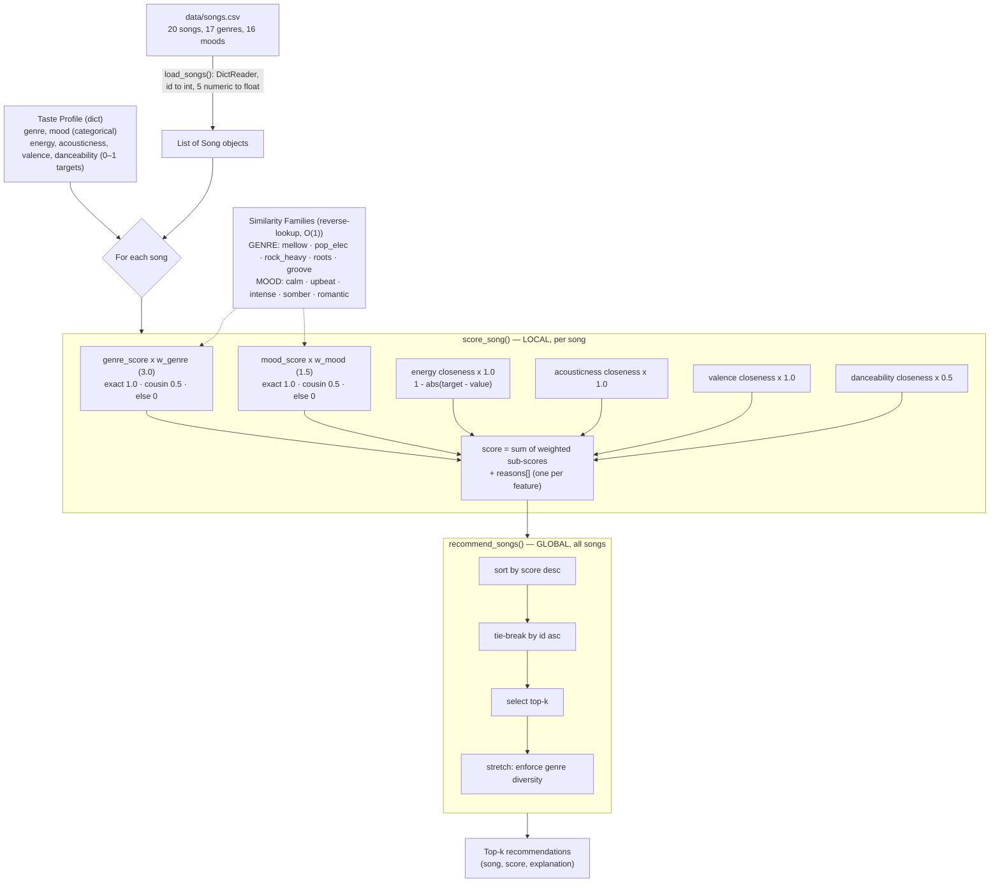

# 🎵 Music Recommender Simulation

## Project Summary

In this project you will build and explain a small music recommender system.

Your goal is to:

- Represent songs and a user "taste profile" as data
- Design a scoring rule that turns that data into recommendations
- Evaluate what your system gets right and wrong
- Reflect on how this mirrors real world AI recommenders

Replace this paragraph with your own summary of what your version does.

---

## How The System Works

Real-world recommenders are usually hybrids of content-based and collaborative
filtering. This simulation is purely **content-based**: it scores each song by
how closely its attributes match a single user's taste profile, using no data
about other users.

**Taste profile** — a small set of targets:

- `genre`, `mood` — categorical preferences
- `energy`, `acousticness`, `valence`, `danceability` — numeric targets on a 0–1 scale

Every field is optional; a missing field simply contributes 0.

**Song features used:** genre, mood, energy, acousticness, valence, danceability.
**Excluded (and why):** `tempo_bpm` (correlates with energy), `artist` (a sparse,
collaborative-style signal), `title` (free text), `id` (identifier).

### Algorithm recipe

Each song earns points from six weighted sub-scores. Every sub-score is 0–1
*before* its weight is applied:

| Feature | How it's matched | Weight |
|---|---|---|
| genre | exact 1.0 · same family 0.5 · else 0 | **3.0** |
| mood | exact 1.0 · same family 0.5 · else 0 | 1.5 |
| energy | closeness = 1 − abs(target − value) | 1.0 |
| acousticness | closeness | 1.0 |
| valence | closeness | 1.0 |
| danceability | closeness | 0.5 |

```
score = 3.0*genre + 1.5*mood + 1.0*energy + 1.0*acousticness
      + 1.0*valence + 0.5*danceability
```

**Similarity families** give partial credit for "cousin" genres and moods, so the
system degrades gracefully — a lofi listener sees ambient/jazz before metal
instead of a hard zero for everything non-lofi:

- Genre families: `mellow` · `pop_elec` · `rock_heavy` · `roots` · `groove`
- Mood families: `calm` · `upbeat` · `intense` · `somber` · `romantic`

**Why genre is weighted 3.0 (not 2.0).** Genre is the decisive signal. At a
weight of 2.0, a same-family *cousin* that happens to match the mood would
out-score an exact-genre song with the wrong mood (2.5 vs 2.0) — letting mood
override genre. At 3.0 those two tie on categorical points (3.0 = 3.0), so the
numeric features break the tie instead. Genre leads; mood and the numeric
features fine-tune within it. (Cousins can still overtake a weak exact-genre
match when overall fit is strong — the family system keeps working until the
genre weight climbs past ~7.)

**Local scoring vs. global ranking.** `score_song` is *local* — it looks at one
song and returns `(score, reasons)`. `recommend_songs` is *global* — it scores
every song, sorts by score descending, breaks ties by `id`, and returns the
top-k. (Stretch: enforce genre diversity within the top-k.)

### Diagram



### Potential biases and risks

- **Filter-bubble / genre lock-in.** Content-based scoring with a heavy genre
  weight (3.0) strongly favors the user's stated genre and its family, so
  genuinely good cross-genre songs rarely surface. The system reinforces existing
  taste and offers little serendipity.
- **Subjective family groupings.** The genre/mood families are hand-authored
  judgment calls (e.g., jazz sits with lofi/ambient in *mellow*; reggae with hip
  hop in *groove*). They encode the designer's cultural assumptions; a listener
  who hears jazz as closer to blues is systematically mis-served.
- **Uneven family sizes.** Larger families offer more partial-credit paths, so
  their songs are structurally easier to recommend. The singleton *romantic* mood
  earns cousin credit for nothing but an exact match, while an *upbeat* song (5
  members) picks up 0.5 far more often — an advantage unrelated to real fit.
- **Symmetric-closeness assumption.** `1 − abs(target − value)` penalizes
  exceeding a target exactly as much as falling short. "I want high energy" is not
  the same as "I want energy near 0.9," but the model treats them identically.
- **Tiny catalog.** With 20 songs across 17 genres, most genres have a single
  track, so exact-genre matches are rare and results lean on families and
  numerics — recommendations are unstable and unrepresentative.

(The model card goes deeper on these.)

---

## Getting Started

### Setup

1. Create a virtual environment (optional but recommended):

   ```bash
   python -m venv .venv
   source .venv/bin/activate      # Mac or Linux
   .venv\Scripts\activate         # Windows

2. Install dependencies

```bash
pip install -r requirements.txt
```

3. Run the app:

```bash
python -m src.main
```

### Running Tests

Run the starter tests with:

```bash
pytest
```

You can add more tests in `tests/test_recommender.py`.

---

## Sample Recommendation Output

Running the app with the built-in "focus / study" taste profile:

```bash
python -m src.main
```

produces:

```
🎵  Music Recommender — your top picks

Taste profile: genre=lofi, mood=chill, energy=0.4, acousticness=0.8, valence=0.55, danceability=0.4
----------------------------------------------------------------
1. Midnight Coding — LoRoom  [lofi · chill]
   Score: 7.77
   Why:
     • genre match (lofi) +3.00
     • mood match (chill) +1.50
     • energy fit (target 0.4, song 0.42) +0.98
     • acousticness fit (target 0.8, song 0.71) +0.91
     • valence fit (target 0.55, song 0.56) +0.99
     • danceability fit (target 0.4, song 0.62) +0.39
----------------------------------------------------------------
2. Library Rain — Paper Lanterns  [lofi · chill]
   Score: 7.75
   Why:
     • genre match (lofi) +3.00
     • mood match (chill) +1.50
     • energy fit (target 0.4, song 0.35) +0.95
     • acousticness fit (target 0.8, song 0.86) +0.94
     • valence fit (target 0.55, song 0.6) +0.95
     • danceability fit (target 0.4, song 0.58) +0.41
----------------------------------------------------------------
3. Focus Flow — LoRoom  [lofi · focused]
   Score: 7.09
   Why:
     • genre match (lofi) +3.00
     • mood cousin of chill (focused) +0.75
     • energy fit (target 0.4, song 0.4) +1.00
     • acousticness fit (target 0.8, song 0.78) +0.98
     • valence fit (target 0.55, song 0.59) +0.96
     • danceability fit (target 0.4, song 0.6) +0.40
----------------------------------------------------------------
4. Spacewalk Thoughts — Orbit Bloom  [ambient · chill]
   Score: 6.16
   Why:
     • genre cousin of lofi (ambient) +1.50
     • mood match (chill) +1.50
     • energy fit (target 0.4, song 0.28) +0.88
     • acousticness fit (target 0.8, song 0.92) +0.88
     • valence fit (target 0.55, song 0.65) +0.90
     • danceability fit (target 0.4, song 0.41) +0.49
----------------------------------------------------------------
5. Coffee Shop Stories — Slow Stereo  [jazz · relaxed]
   Score: 5.40
   Why:
     • genre cousin of lofi (jazz) +1.50
     • mood cousin of chill (relaxed) +0.75
     • energy fit (target 0.4, song 0.37) +0.97
     • acousticness fit (target 0.8, song 0.89) +0.91
     • valence fit (target 0.55, song 0.71) +0.84
     • danceability fit (target 0.4, song 0.54) +0.43
----------------------------------------------------------------
```

**Screenshot or video** *(optional)*: <!-- Insert a screenshot or demo video link here -->

---

## Experiments You Tried

Use this section to document the experiments you ran. For example:

- What happened when you changed the weight on genre from 2.0 to 0.5
- What happened when you added tempo or valence to the score
- How did your system behave for different types of users

---

## Limitations and Risks

Summarize some limitations of your recommender.

Examples:

- It only works on a tiny catalog
- It does not understand lyrics or language
- It might over favor one genre or mood

You will go deeper on this in your model card.

---

## Reflection

Read and complete `model_card.md`:

[**Model Card**](model_card.md)

Write 1 to 2 paragraphs here about what you learned:

- about how recommenders turn data into predictions
- about where bias or unfairness could show up in systems like this


